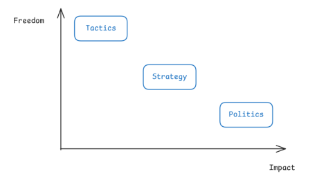
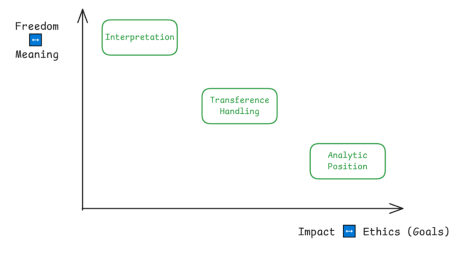
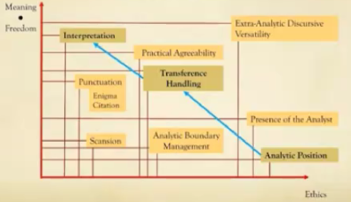

# Clinical Technique 1: Transference

时间：`2025年9月29日15:47:18`

## 1. 总起：Three fundamental dimensions of the direction of treatment

### Intro

- 治疗的三个基础维度；移情、interpretation、分析立场
  - 来自拉康1958年发表的论文《治疗方向及其作用原理》，被收入在《文集》中
- Direction
  - 一方面，指的是治疗是如何进行的、分析师是如何把控治疗的
  - 另一方面，指的是治疗的目标和目的

### **理论背景**

这篇论文中，与direction相关的模型来自德国将军卡尔·冯·克劳塞维茨于1832年写作的《战争论》（On War）

#### 克劳塞维茨的模型

这个模型的核心思想是，战争并非孤立的暴力行为，而是一个层级分明、逻辑贯通的系统。它揭示了在任何有目的的冲突中，行动的自由度与其根本性的影响力之间存在着一种反比关系。

- 战争应该基于**战术（tactics）**、**战略（strategy）** 和 **政治（politics）** 来进行区分
- 这三个基础的维度在**自由度（freedom）** 和 **影响度（impact）** 上有所不同
  - **战术**方面
    - 战术是“战斗的艺术”，它发生在具体的战场上。它回答的问题是：“我们如何打赢这场具体的战斗？”这涉及部队的具体部署、火力协同、冲锋时机、防御阵型的选择等等。
    - 自由度最高：在战场上，指挥官面对着瞬息万变的战局和大量的偶然性，他们拥有极高的临场决策权，可以决定是左翼包抄还是右翼突击，是集中兵力还是分散防守，是佯装撤退还是坚守阵地。这里的选择几乎是无限的，充满了灵活性和创造性。
    - 影响度最低：单一一两场战斗的胜负，通常不足以决定整个战争的结局，即使将军们在战场上反了几个错误，这些错误对战争的输赢很可能没有什么影响。一场战术上的大捷可能只是一次战略佯攻的胜利；而一次战术上的惨败可能只是为了给战略主力争取时间。
  - **战略**方面
    - 战略是连接“政治目的”与“军事行动”的桥梁。它回答的问题是：“我们如何通过**一系列军事行动**来达成政治目的？”战略家需要调动和部署国家所能提供的所有资源（军队、经济、外交），设计一场或多场**战役（Campaigns）**，以最有效的方式服务于最终的政治目标。
    - 自由度中等：在既定的政治目标下，战略家依然有多种选择。例如，为了实现“吞并A地”这个政治目标，可以选择速战速決的闪电战，也可以选择持久消耗的围困战；可以主攻东线，也可以佯攻西线。这些不同的战略路径提供了相当大的选择空间，远比更改政治目标要自由。但这种自由又受到政治目标的严格约束，你不能选择一个与政治目的背道而驰的战略。
    - 影响度中等：一个好的战略可以事半功倍，一个坏的战略则可能满盘皆输。战略的成败直接关系到战争的走向和最终能否实现政治目的。它的影响力远大于单次战斗的胜负，但其最终的“意义”依然需要由政治层面来裁定。
  - **政治**方面
    - 政治是战争的“子宫”。它回答了最根本的问题：“我们为何而战？”政治设定了战争的最终目的、定义了何为“胜利”，并为整个军事行动赋予了意义和合法性。它代表了国家的意志、意识形态、和长远利益。克劳塞维茨那句不朽的名言——“战争无非是政治通过另一种手段的继续”——正是此意的精髓。
    - 一个国家一旦确定了其根本的政治目标（例如，寻求独立、吞并领土、或捍卫某种意识形态），这个目标就变成了整个战争机器必须服从的“第一推动力”。你不能轻易在战争中途说：“我们换个政治目标吧。”这样做等于否定了战争本身的基础，会导致整个行动的崩溃。政治目标具有根本性和稳定性，因此选择极少，自由度最低；而影响最大

#### 拉康的模型（一种映射（map））

- 拉康将战争的三个维度改为了治疗方向的三个维度
  - 战术 → interpretation
  - 战略 → 移情
  - 政治 → 分析立场
- 坐标轴的意义
  - 纵轴：freedom ↔ meaning
    - High meaning：意味着意义的增殖、泛滥和不确定性。在自由联想中，一个词可以引出无数个联想，一个梦境可以有多重解释。
    - Low meaning：意味着意义的收束、凝固和指向一个核心。这里的“低自由度”并非指压抑，而是指整个分析过程开始触及一个无法再被轻易解释或逃避的根本“硬核”。
  - 横轴：impact ↔ ethics **(i.e. the goals)**
    - High ethics：指那些对主体的根本存在姿态影响甚微的局部操作。它们可能产生瞬间的效果，但不足以撼动主体的根本结构。
    - Low ethics：指那些直接关系到分析最终目标的决定性因素。
- Interpretation、移情和分析立场
  - **Interpretation**
    - 一方面，分析师在interpretation方面有很多的选择和很强的flexibility，他们不需要遵循什么教科书或者手册，因为其对治疗的影响相对较小。另一方面，矛盾的是，interpretation在meaning方面具有higher degree。这意味着，分析师的口头干预会被病人理解为比对移情的处理、分析立场都要有意义的事 → 并不是meaning越丰富，对治疗的影响越大
    - **High meaning & Low ethics**：Interpretation打开了意义的无限可能性。当分析师只说一个词，比如“然而…”，病人会被迫去思考这个“然而”可能指向的一切。这引发了意义的爆炸，是能指链条最自由的嬉戏（Play）。然而，单次的interpretation，就像单次战斗，其本身的影响是局部的、暂时的。它可能带来一次“啊哈！”的体验，但如果缺乏后续的战略和根本的伦理立场，**这种体验很快会被主体的防御机制所消解。无数次成功的“战术诠释”如果不能导向整个结构的改变，那分析就是在原地打转**。
  - **移情处理 (Transference Handling)**
    - **中等的meaning**：在这里，意义不再是天马行空的。所有的言说和诠释都开始围绕着一个核心展开，那就是“移情关系”本身。病人的话语，无论内容是什么，都在战略层面上被理解为：“他/她现在是在对我（作为父亲/母亲/爱人形象的分析师）说什么？他/她想从我这里得到什么？”意义的自由度被这个战略框架所约束。
    - **中等的ethics**：移情的处理直接决定了分析的走向。一个好的战略家（分析师）能利用移情让分析不断深入；一个糟糕的战略家则可能陷入与病人的权力斗争、情感纠葛，导致分析停滞甚至失败。它决定了每一次“战术诠释”能否累积成有效的“战役”成果，从而朝向最终的伦理目标迈进。
  - **分析立场 (Analytic Position)**
    - 这是整个分析结构的基石。它关乎分析师到底占据了一个什么样的位置。这个位置不是分析师本人的“自我”，而是由一系列严格的伦理规则所定义的功能性位置。
    - **Low meaning**：在这个层面，几乎没有自由。分析师的立场是非如此不可的。他们不能成为朋友、老师、道德家。他们的回应受到严格的伦理约束。这个立场本身是反意义的。
    - **High ethics**：这个立场就是分析的伦理本身。它定义了何为“分析”，并为整个过程赋予了方向和可能性。如果分析师的“政治立场”发生了动摇（例如，违背了伦理、满足了病人的移情性需求），那么无论他的“诠释战术”多么华丽，“移情战略”多么精妙，整个分析都将崩塌，因为它失去了存在的根本理由和伦理目标。它直接决定了分析这趟旅程的终点在哪里，以及是否可能抵达。

#### 总体的内容

---

## 2. 移情观念的发展

### 拉康的“移情”概念与弗洛伊德的不同

#### 弗洛伊德

- 移情是一种联系
  - 移情只是病人和分析师之间的感情纽带
  - 这是一种病人在分析治疗开始时进入的一种情感关系
  - 弗洛伊德花了很长时间才承认移情的重要性，少女朵拉的案例使他付出了“惨痛”的教训
- 移情是一种重复（repetition）
  - 弗洛伊德认为移情是一种回归，即一种旧的、无意识被压抑的形象在分析环境中的再现；这意味着移情不是新的东西、不是在治疗开始之后凭空产生的东西，而是一种过去的回归
  - 例如，弗洛伊德会认为，移情是病人将父亲/母亲的形象投射到分析师身上
  - 移情是病人在无意识的、没有被意识到的情况下与分析师建立的连接
- 移情可以有很多不同的形式
  - 区分了完全负面的移情（被仇恨所约束的移情）和完全正面的移情（完全由爱意约束的移情），以及可以在精神分析中起作用的移情
  - 分析成功的关键在于，移情不能是完全正面或完全负面的，而应该是二者的混合
  - 例如，如果移情是完全正面的，那么病人可能会很享受分析的过程而不愿意离开分析的疗程

 #### 拉康

- 将移情从感情的领域移到了认识/认识论（epistemic）的领域
  - 移情主要来源于对知识的归因（attribution），是一种将某种思维过程或者表征对分析师的一个归因（分析者将一种“关于自己无意识真相的知识”预设并安置（归因）在分析师身上，即认为分析师是SSK）
  - 这不意味着感情因素消失了，而是说认识的层面比感情层面更加重要
- 拉康认为，移情不只是重复和过去的回归，而其自身也包含了某些新的东西
  - 移情和这次的治疗之中总有某些新东西，有某些不同于过去和上次治疗的东西
  - 移情不只是旧事物的循环，而是无意识在分析情境下的实现；随着某些被压抑的特征的实现/被带入现实，被激活的其实是语言的结构
- 将弗洛伊德的“正面”和“负面”替换成“想象的”和“象征的”
  - 如果移情关系是想象的，这意味着分析师被视作竞争者、被视作需要被打败的人
  - 如果移情关系是象征的，这意味着病人接受了“权力差异（power differential）”的事实，不仅是权力的不对等，也是经历、知识的不对等
    - 权力差异：指的不是社会、政治或经济上的权力，而是一种在分析情境中被刻意建立和维持的、结构性的、功能性的不对等关系。这种差异是分析得以进行的前提条件。它意味着分析师和分析者不是朋友、不是平等的交谈者，也不是商业伙伴。它的目的不是为了压迫分析者，而是为了创造一个独特的空间，让无意识得以在此空间中显现。
    - 经历的不对等：临床经验、个人分析经验
    - 这种移情是分析的动力
  - 注意：拉康的**L图式中**，分析师的自我和病人的自我之间是想象关系，而分析师代表的大他者和病人的主体之间是象征关系

#### 共同点

- 二人对移情的看法和重要性大体上来说是相似的
- 弗洛伊德认为移情是治疗的引擎/发动机，正是由于移情，整个分析治疗才得以进行
- 所以拉康将移情称为“治疗的时间”，这意味着移情决定了治疗会持续的时间

### 拉康对移情的观点的发展

- 早期：L图式区分了两种移情（见上）
- 但是久而久之，拉康意识到，想象性移情和象征性移情之间的差别并没有那么明显
  - 正如弗洛伊德得出结论：移情总是正面和负面的结合。拉康也得出结论：移情很多时候是由想象的元素和象征的元素混合而成的
  - 相似性、竞争（想象性移情）和差异性（象征性移情）可以被结合在同一类的移情当中

---

## 移情

### 为什么移情如此重要？

1. 移情影响了how words are being heard
   1) 同样的话会被听者理解为不同的意思：病人听到的不仅仅是一句话，而是一句来自一个ta（指病人）赋予了某些形象和性格的人说的话
   2) 例如，在少女朵拉的案例中，正是由于弗洛伊德将自己置于一个“男性权威”的位置上，才导致了朵拉拒绝听他的所有话
   3) 移情会严重影响到interpretation被接受的方式：一个不合作的、与分析师竞争的病人的治疗效果，会不同于一个合作的、将分析师看作一个mentor的病人的治疗效果
2. 移情决定了病人对分析的投入程度

### 移情的三个方面

1. **Transference Handling**
   1) 分析师要一直在一种不可判定的状态（a state of undicidability）下维持着移情的性质和本质
      1. 不可判定的状态意味着分析师需要保证自己能在知识渊博和无知、爱和恨以及其他相对立的属性/归因（attribution）中来回徘徊；分析师最不应该做的事情就是认同某一种归属、某一种病人对于自己的看法
      2. 如果分析师认同了某个身份，那么ta就处于完全的想象移情的风险之中，分析师与病人的位置也将被固定住（不仅是分析师的位置被固定了，病人的位置也被固定了，因为二者往往是相对的）
   2) 要确保分析师的位置是在变动的
2. **Practical Agreeability**
   1) 指的是满足病人需求的程度
   2) 当关系到治疗的可行性时，分析师永远不应该去满足病人的每一个要求；反过来说，如果分析师想要满足病人的某个要求，ta必须证明其合理性
      1. “可行性”在这里指的不是日常意义上的“方不方便”，而是指“精神分析这种独特的治疗方法是否还能进行下去”。
      2. 分析师在考虑是否“通融”病人的要求时，其判断标准不是“我是否应该做一个体贴、友善的人”，而是“如果我同意了这个要求，精神分析这个工作还能不能继续下去？”
   3) 例如，当病人要求改变分析的时间、地点或者频率时，分析师应当考虑，这到底是他们神经症的一部分（**神经症移情**），还是他们真的出于一些无法避免的原因
3. **Analytic boundary management**
   1) Maintain the boundary between what happens during the sessions, as opposed to what happens outside the session（（分析师必须）维持在分析时段内所发生之事与分析时段外所发生之事间的边界）；要划清治疗之内和之外的界限
   2) 分析师在处理会面时间之外的与病人的互动时，需要很小心；此外，有时病人也会给分析师送东西，这种行为并不是“中立”的，分析师需要考虑是否应该接受、是否需要将这个举动纳入分析
   3) “维持内外边界”是精神分析的一条铁律。它不是为了让分析师显得冷漠或不近人情，而是为了创造并守护一个独一无二的、能够让无意识得以显现、让移情得以纯粹展现、从而让“言说”产生疗愈效果的象征性空间。破坏这个边界，就等于摧毁了精神分析本身。
